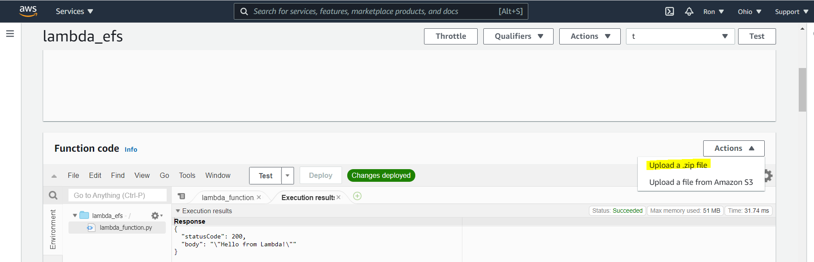

# AWS-cheat-sheet
A cheat sheet, including code, that will simplify our work with AWS

## Build a REST API with Lambda
1. AWS search - > Lambda
2. Create function
3. From scratch
4. Name the function
5. Runtime (Python version)
6. Choose permissions/roles
7. Write the function
8. Test - > create event -> test (again)
9. Check the logs

**To create resources:**
1. Search bar - > API getaway
2. Get started button
3. Select REST
4. New API
5. Choose API name, leave the rest as default
6.  Create API button
7. Actions -> create resources - > choose name, leave the rest as default
8. Actions -> create method -> GET -> Lambda function
9. USe lambda proxy integration -> Check
9. Lambda function -> select function from stage 2
10. Actions -> Deploy API -> new stage -> stage name: test -> Deploy

**Testing:**
11. Run **Invoke URL** on browser with dummy parameters
12. If you defined a json in the original function (like the function in thi repo), you should get a json on your browser.

[Recommended tutorial](https://www.youtube.com/watch?v=uFsaiEhr1zs&feature=emb_logo)

## Import packages to AWS

1. Go to your venv diretory on your file manager
2. venv -> Lib ->site-packages -> zip all files
3. Actions -> Upload zip file

[Recommended tutorial](https://www.youtube.com/watch?v=ItE6MAZaiJY&t=167s)

## EFS (Elastic File System)

[Recommended tutorial](https://www.youtube.com/watch?v=4cquiuAQBco)

